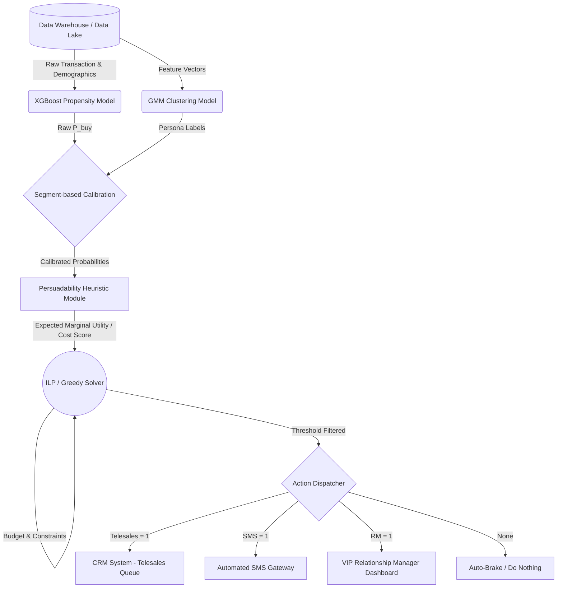

# BÁO CÁO KẾT QUẢ VÒNG 4.2: ENTERPRISE-GRADE DECISION ENGINE
**Đội thi:** GCON (Nguyễn Tiến Mạnh, Phạm Văn Linh, Trần Đức Lập)

---

## PHẦN 1: TỔNG QUAN KIẾN TRÚC HỆ THỐNG (SYSTEM ARCHITECTURE)

Hệ thống Decision Engine không chỉ là một file code chạy rời rạc. Để triển khai thực tế tại một ngân hàng, hệ thống được thiết kế chạy **Batch Daily (Cập nhật hàng ngày)** vào lúc 02:00 AM, theo luồng kiến trúc liền mạch sau:

**Kịch bản vận hành:**
1. Mỗi đêm, **Data Warehouse** đẩy hàng triệu bản ghi khách hàng mới nhất.
2. Mô hình **NBFO (XGBoost)** dự báo xác suất thô, đồng thời **GMM** phân loại họ vào 12 Personas.
3. Module **Calibration** hiệu chỉnh xác suất chéo theo từng Sản phẩm x Persona để xóa bỏ độ lệch (bias).
4. Module **Persuadability Heuristic** tính toán hàm $EMU(P)$ từ xác suất đã calibrate. Khách hàng có EMU âm bị loại ngay lập tức.
5. Bộ giải **Solver (ILP/Greedy)** cầm 1 Tỷ ngân sách và giới hạn công suất kênh để nhặt ra phương án tối ưu nhất.
6. Kết quả đẩy thẳng vào màn hình CRM của Telesales vào 08:00 AM sáng hôm sau.

---

## PHẦN 2: PHÂN TÍCH 12 PERSONAS VÀ LOGIC UNIT ECONOMICS

Hệ thống phân chia 251,889 khách hàng thành 12 nhóm hành vi (5 IB và 7 Non-IB). Với mỗi nhóm, chúng tôi thiết lập Ma trận Tiện ích Tài chính (FUM) cực kỳ gắt gao dựa trên rủi ro nghiệp vụ.

### 2.1. Nhóm Khách hàng IB (Mục tiêu Cross-sell NBFO)
| Persona (Phân khúc) | LTV (True Positive) | Phạt Rác (FP) | Phạt Bỏ Lỡ (FN) | Giải thích Logic Kinh Doanh |
|:---|:---|:---|:---|:---|
| **Wealthy Passive** | +5,000,000 VND | -50,000 VND | **-30,000,000 VND** | Khách VIP gửi tiền nhiều nhưng ít giao dịch. Nếu lỡ cơ hội chốt Sale, bank mất khoản huy động vốn khổng lồ. Bắt buộc dùng RM. |
| **Digital VIP** | +5,000,000 VND | -50,000 VND | **-30,000,000 VND** | VIP am hiểu công nghệ. Bỏ lỡ họ đồng nghĩa với việc họ sẽ chuyển sang ngân hàng số đối thủ. |
| **Mass Active** | +5,000,000 VND | -50,000 VND | 0 VND | Khách phổ thông, giao dịch nhiều. TP mang lại doanh thu tốt, nhưng nếu lỡ (FN) thì cũng không quá thiệt hại. Chú trọng tránh spam (FP). |
| **Young Digital** | +5,000,000 VND | -50,000 VND | 0 VND | Nhóm trẻ thích công nghệ. Rất nhạy cảm với Spam nên FP phạt nghiêm ngặt. |
| **Standard** | +5,000,000 VND | -50,000 VND | 0 VND | Khách hàng vãng lai cơ bản. |

### 2.2. Nhóm Khách hàng Non-IB (Mục tiêu Onboarding / Cài App)
Thay vì dùng NBFO propensity model cho Non-IB, chúng tôi ước lượng LTV onboarding bằng cohort khách hàng IB mới. Cụ thể, trên nhóm `IB_TENURE_MONTHS <= 12`, tỷ lệ khách hàng có ít nhất một cross-sell event (`any SUBSCRIPTION = 1`) là khoảng **41.2%**. Vì một cross-sell thành công trong FUM IB được định giá **5,000,000 VND**, LTV onboarding được lấy theo công thức:

$$ LTV_{NonIB} = P(CrossSell\ năm\ đầu | IB\ mới) \times 5,000,000 \approx 0.412 \times 5,000,000 = 2,060,000\ VND $$

Con số này không cộng thêm revenue proxy từ phí giao dịch/spread huy động vì chưa có fee rate chính thức, nên vẫn là estimate bảo thủ dựa trên target cross-sell thật. Toàn bộ 127,003 khách hàng Non-IB được GMM phân thành **chính xác 7 Cụm (Personas)**.

| Persona (Phân khúc) | LTV (True Positive) | Phạt Rác (FP) | Base Rate Phân bổ | Logic Gán Xác Suất Hậu Nghiệm |
|:---|:---|:---|:---|:---|
| **Traditional (80,041 khách)** | +2,060,000 VND | -5,000 VND | 10.68% | Khách hàng truyền thống bám quầy giao dịch, nhưng cohort tracking cho thấy vẫn có khả năng onboarding thực tế. |
| **Dormant / Ngủ đông (24,570 khách)** | +2,060,000 VND | -2,000 VND | 40.18% | Nhóm ít hoạt động nhưng dữ liệu lịch sử cho thấy còn dư địa chuyển đổi khi tiếp cận đúng. |
| **High-Value Saver (13,180 khách)** | +2,060,000 VND | -15,000 VND | 15.62% | Khách có số dư tốt. Cần App để theo dõi lãi suất tiết kiệm. |
| **Senior High-Value Saver (7,504 khách)** | +2,060,000 VND | -10,000 VND | 18.02% | Khách lớn tuổi gửi tiền nhiều. Mất công sức thuyết phục ban đầu nhưng cài App xong sẽ gắn bó lâu dài. |
| **High-Value Heavy Borrower (653 khách)** | +2,060,000 VND | -15,000 VND | 91.44% | Đang vay số tiền lớn. Nhu cầu cài App để theo dõi khế ước nhận nợ và lịch trả lãi là rất cao. |
| **Senior High-Value Heavy Borrower (562 khách)** | +2,060,000 VND | -10,000 VND | 91.83% | Vay nợ lớn và lớn tuổi. Họ cần công cụ số hóa để kiểm soát dòng tiền trả nợ phức tạp của mình nhất. |
| **High-Value Traditional (493 khách)** | +2,060,000 VND | -8,000 VND | 78.03% | Giàu nhưng bảo thủ; historical onboarding rate cao nên vẫn đáng ưu tiên nếu vượt ngưỡng kinh tế. |

---

## PHẦN 3: BỘ CÔNG THỨC TOÁN HỌC VÀ THUẬT TOÁN TỐI ƯU

### 3.1. Persuadability Score dựa trên tư duy Uplift
Ở vòng này, dữ liệu không có A/B test hoặc treatment/control log để ước lượng causal uplift đúng nghĩa. Vì vậy, GCON **không claim đang train uplift model**. Thay vào đó, chúng tôi dùng một business heuristic lấy cảm hứng từ tư duy uplift: ưu tiên nhóm khách có khả năng bị tác động bởi marketing, thay vì chỉ ưu tiên nhóm có xác suất mua cao nhất.

$$ Persuadability(P) = 4 \times P \times (1-P) $$

Hàm này đo mức độ "do dự" của khách hàng. Khách hàng có $P=0.5$ đang ngập ngừng nhất, nên marketing được giả định có tác động mạnh nhất. Khách hàng có $P \approx 0$ hoặc $P \approx 1$ gần như đã quyết định rồi, nên marketing ít tạo thêm giá trị biên.

Khi áp dụng theo từng kênh, điểm này được nhân với conversion rate của kênh:

$$ ResponseLiftProxy_c(P) = Persuadability(P) \times CR_c = 4 \times P \times (1-P) \times CR_c $$

Đây là **uplift-inspired persuadability proxy**, không phải causal uplift estimate từ A/B test.

### 3.2. Phương trình Lợi Ích Biên Kỳ Vọng (Expected Marginal Utility - EMU)
Dòng tiền thuần sinh ra khi áp dụng 1 kênh Marketing $c$ lên 1 khách hàng:
$$ EMU_c(P) = ResponseLiftProxy_c(P) \times (TP - FN) + FP - Cost_c $$

Trong công thức này, $FP$ là chi phí tiếp cận nhầm/spam của hành động liên hệ, không phải penalty cho toàn bộ nhóm khách hàng không convert.

### 3.3. Thuật toán Break-Tie (Chống Chọn Ngẫu Nhiên)
Khi giải bài toán Cái túi (Knapsack), sẽ xảy ra hiện tượng có hàng ngàn khách hàng Non-IB mang lại chung một mức $EMU$. Nếu để thuật toán ILP tự chạy, nó sẽ bốc Random. Chúng tôi bổ sung một biến vi phân:
$$ EMU_{final} = EMU_{core} + 10^{-6} \times \text{Asset\_Proxy\_Score} $$
Thuật toán lập tức xếp hạng ưu tiên những người có Tài sản cao, biến quá trình chọn lọc trở nên Deterministic (Chắc chắn 100%).

---

## PHẦN 4: VECTOR ĐA NGƯỠNG TỐI ƯU (TASK 1 OUTPUT)

Bằng cách dùng thuật toán Dò nghiệm (Root-finding) giải phương trình $EMU_c(P) = 0$, chúng tôi tìm được các điểm cắt sinh tử (Thresholds). Dưới mức này, hệ thống sẽ tự động phanh lại (Auto-Brake) và từ chối gửi tin nhắn để chống lãng phí.

| Persona (Phân khúc) | Ngưỡng Kênh SMS | Ngưỡng Kênh Telesales | Ngưỡng Kênh RM (VIP) |
|:------------------------|----------------:|----------------------:|:---------------|
| **Wealthy Passive (IB)**     |          0.0202 |                0.0146 | 0.1098         |
| **Digital VIP (IB)**         |          0.0446 |                0.0268 | 0.1664         |
| **Mass Active (IB)**         |          0.0670 |                0.0758 | N/A            |
| **Young Digital (IB)**       | No ROI          |                0.1838 | N/A            |
| **Standard (IB)**            |          0.1292 |                0.1000 | N/A            |
| **Senior High-Value Saver** |      0.0274 |                0.0446 | No ROI         |
| **Traditional**         |          0.0650 |                0.1588 | N/A            |
| **Dormant / Ngủ đông**        |          0.0446 |                0.1482 | N/A            |
| **High-Value Saver**        |          0.0898 |                0.1208 | N/A            |
| **High-Value Heavy Borrower**|          0.0660 |                0.0878 | N/A            |
| **Senior High-Value Heavy Borrower**| 0.0320 |                0.0524 | No ROI         |
| **High-Value Traditional**  |          0.0682 |                0.1304 | N/A            |

*(Lưu ý Kiến trúc Hệ thống: Bảng ngưỡng trên là minh họa cho một ma trận chung. Trong cấu hình thực tế, module tính toán của Decision Engine chạy theo chiều sâu **Sản phẩm x Persona (Product * Persona)**. Nghĩa là ngưỡng cắt lỗ để bán Thẻ Tín Dụng cho Digital VIP sẽ hoàn toàn khác với ngưỡng cắt lỗ để mời Vay Tiêu Dùng cho chính nhóm này. Khách hàng nào đạt max(Propensity) so với Threshold của sản phẩm tương ứng sẽ được chọn làm "Next Best Offer".)*

**🔥 INSIGHT TỪ BẢNG NGƯỠNG:** 
- **Young Digital (IB)** nhạy cảm với Spam (FP) rất cao, nên SMS rơi vào trạng thái **No ROI** theo FUM hiện tại; hệ thống chỉ cân nhắc Telesales nếu xác suất vượt ngưỡng.
- **Traditional và Dormant** sau khi cập nhật LTV onboarding lên **2.06 Triệu VND** đã có ngưỡng Telesales dương thay vì "No ROI"; engine vẫn chỉ mở kênh khi xác suất vượt ngưỡng tương ứng.
- Nhóm Non-IB VIP (VD: Senior High-Value Saver) được đánh giá lại theo cùng LTV onboarding mới. RM chỉ được mở nếu EMU dương sau khi trừ chi phí vận hành 2,000,000 VND/cuộc tiếp cận.

*Insight:* Threshold giữ vai trò auto-brake kinh tế; sau khi vượt ngưỡng, kênh được chọn theo **EMU lớn nhất** trong các kênh đủ điều kiện.

---

## PHẦN 5: KIẾN TRÚC RA QUYẾT ĐỊNH 2 BƯỚC (TASK 2 OUTPUT)

Để giải quyết triệt để bài toán phân bổ, Decision Engine hoạt động theo một quy trình **2 Bước (Two-Step Process)** cực kỳ tối ưu:

- **Bước 1 (Lọc - Filtering):** Với mỗi khách hàng, hệ thống lấy Xác suất đối chiếu với 3 Ngưỡng của chính Persona đó. Nếu Xác suất không vượt qua bất kỳ ngưỡng nào -> Hệ thống gán `None` (Cắt bỏ ngay lập tức để tiết kiệm chi phí và chống Spam).
- **Bước 2 (Tối ưu - Optimization):** Những khách hàng vượt ngưỡng sẽ tạo thành một "Danh sách đủ điều kiện" (Eligible List). ILP Optimizer (Thuật toán tối ưu tuyến tính nguyên) sẽ giải bài toán Knapsack: Trong giới hạn ngân sách 1 Tỷ VND và giới hạn số lượng nhân viên, chọn ai và dùng kênh nào để Tổng Lợi nhuận (Total Profit) của cả ngân hàng là lớn nhất!

Dưới đây là trích xuất từ database `final_allocations.csv` thể hiện sự sắc bén của thuật toán:

| CUSTOMER_ID | PERSONA | Sản phẩm Gợi ý (Product) | Xác suất | Kênh Gợi ý | Lập luận thuật toán 2-Bước |
|---:|:---|:---|---:|:---|:---|
| 105 | Wealthy Passive (IB) | CURRENT_ACCOUNT | 59.50% | **None** | Không được phân bổ vì sau lớp threshold/filtering, EMU khả dụng không còn dương trong cấu hình hiện tại. |
| 541 | Young Digital (IB) | CREDIT_CARD | 0.36% | **None** | Không vượt ngưỡng Telesales của Young Digital và SMS là No ROI, nên bị Auto-Brake. |
| 3 | Mass Active (IB) | TERM_DEPOSIT | 3.5% | **None** | B1: Xác suất 3.5% < Ngưỡng SMS rẻ nhất của nhóm này. |
| 0 | Young Digital (IB) | TERM_DEPOSIT | 12.0% | **None** | Khách trẻ nhạy cảm spam, SMS No ROI và Tele cần xác suất cao hơn. |
| 13 | Standard (IB) | CURRENT_ACCOUNT | 27.22% | **SMS** | Vượt ngưỡng và SMS có EMU dương cao nhất trong các kênh khả dụng cho khách hàng này. |
| 69 | Standard (IB) | CURRENT_ACCOUNT | 53.31% | **Telesales** | Xác suất cao hơn làm EMU tuyệt đối của Telesales thắng SMS. |
| 3148 | Wealthy Passive (IB) | CURRENT_ACCOUNT | 49.24% | **RM** | VIP có giá trị kỳ vọng lớn; RM được chọn khi EMU tuyệt đối vượt SMS/Telesales sau chi phí. |
| 4 | Senior High-Value Saver | Digital Onboarding | 17.57% | **SMS** | Vượt threshold onboarding; SMS là kênh có EMU tốt nhất trong cấu hình khách hàng này. |
| 30 | Dormant / Ngủ đông | Digital Onboarding | 40.97% | **SMS** | Vượt ngưỡng SMS và Telesales; SMS vẫn có EMU cao nhất sau cost và response-lift proxy. |

**Tổng kết Dòng tiền (Baseline - Ứng dụng Real Historical Data):**
* Kênh phân bổ: **SMS** (69,026 lượt), **Telesales** (6,665 lượt), **RM** (160 lượt).
* Lợi nhuận sinh ra từ **response-lift proxy**: **4.35 Tỷ VND**.
* Chi phí vận hành: **998.4 Triệu VND**.
* Stress test FP VIP +20%, CR Telesales/RM -15%: **4.25 Tỷ VND**, với **SMS** (70,574), **Telesales** (7,547), **RM** (134).

---

## PHẦN 6: PHÂN TÍCH ĐỘ NHẠY 2D & ĐIỂM GÃY AUTO-BRAKE (TASK 3)

Để chứng minh hệ thống chịu được bão khủng hoảng, chúng tôi chạy vòng lặp mô phỏng Bản đồ nhiệt (Heatmap) trên 16 kịch bản đa biến:
- **Trục X:** CR của RM giảm dần (do Sales chốt kém).
- **Trục Y:** Rủi ro phạt FP Khách VIP tăng dần.
- **Policy cố định:** Threshold/eligible pool được giữ theo baseline, chỉ EMU trong từng scenario thay đổi theo CR/FP stress. Nhờ vậy heatmap đo sức chịu đựng của chiến lược hiện tại, không phải một engine tự recalibrate trước khủng hoảng.

**MA TRẬN LỢI NHUẬN THUẦN (VND):**
| Mức tăng Phạt rác (FP) | RM giảm 5% CR | RM giảm 10% CR | RM giảm 15% CR | RM giảm 20% CR |
|:--------|------------:|------------:|------------:|------------:|
| **+10% FP VIP** | 4.63 Tỷ | 5.04 Tỷ | 5.50 Tỷ | 5.96 Tỷ |
| **+20% FP VIP** | 4.62 Tỷ | 5.02 Tỷ | 5.48 Tỷ | 5.94 Tỷ |
| **+30% FP VIP** | 4.60 Tỷ | 5.01 Tỷ | 5.46 Tỷ | 5.92 Tỷ |
| **+40% FP VIP** | 4.59 Tỷ | 4.99 Tỷ | 5.44 Tỷ | 5.90 Tỷ |

**MA TRẬN RÚT QUÂN (SỐ LƯỢT RM):**
| Mức tăng Phạt rác (FP) | RM giảm 5% CR | RM giảm 10% CR | RM giảm 15% CR | RM giảm 20% CR |
|:--------|---------:|----------:|----------:|----------:|
| **+10% FP VIP** | 150 slot | 107 slot | 47 slot | 0 slot |
| **+20% FP VIP** | 150 slot | 106 slot | 46 slot | 0 slot |
| **+30% FP VIP** | 150 slot | 106 slot | 46 slot | 0 slot |
| **+40% FP VIP** | 150 slot | 105 slot | 45 slot | 0 slot |

**🔥 KẾT LUẬN INSIGHT KINH DOANH TỪ HEATMAP:**
1. **Heatmap đã đồng bộ engine:** Kịch bản hiện dùng cùng FUM theo persona, cùng onboarding rate mới, cùng EMU đã sửa và cùng baseline threshold filter theo kênh.
2. **RM rút quân theo max EMU:** Khi CR RM giảm, EMU tuyệt đối của RM mất dần lợi thế trước SMS/Telesales; số slot RM giảm từ khoảng 150 về 0 khi RM bị stress 20%.
3. **Profit tăng theo cột là dấu hiệu cần diễn giải:** Trong cấu hình hiện tại, RM stress làm một phần khách hàng chuyển sang kênh rẻ hơn, nên tổng profit có thể tăng dù RM yếu đi. Đây không phải do recalibrate threshold, vì eligible pool đã được giữ cố định theo baseline.
