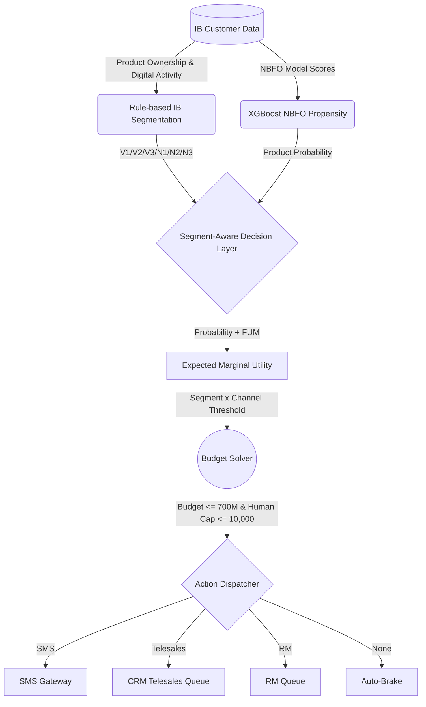

# BÁO CÁO KẾT QUẢ VÒNG 4.2: DECISION ENGINE - IB ONLY SCENARIO
**Đội thi:** GCON (Nguyễn Tiến Mạnh, Phạm Văn Linh, Trần Đức Lập)

---

## PHẦN 1: TỔNG QUAN KỊCH BẢN

Theo yêu cầu thử nghiệm mới, Decision Engine được chạy lại với 2 thay đổi:

1. **Loại hoàn toàn nhóm Non-IB khỏi phần tính toán.**
2. **Giảm budget constraint từ 1,000,000,000 VND xuống 700,000,000 VND.**

Luồng hệ thống sau khi loại Non-IB:



---

## PHẦN 2: IB SEGMENTATION

IB được chia bằng rule cascade:

```python
if login_count == 0:
    segment = 'N3_Dormant'
elif AVG_LOAN_AMOUNT > 500_000_000:
    segment = 'V1_HV_Borrower'
elif AVG_TD_BALANCE > 100_000_000 and has_loan == 0:
    segment = 'V2_Conservative'
elif product_depth >= 3 and AVG_TD_BALANCE > 200_000_000:
    segment = 'V3_Multi_Premium'
elif has_card == 1 and has_loan == 1:
    segment = 'N1_Active_Digital'
else:
    segment = 'N2_Semi_Digital'
```

| Segment | Nhóm | Logic kinh doanh |
|---|---|---|
| V1_HV_Borrower | VIP | Dư nợ lớn, cơ hội cross-sell cao |
| V2_Conservative | VIP | Gửi tiền lớn, không vay, cần tiếp cận thận trọng |
| V3_Multi_Premium | VIP | Đa sản phẩm, tài sản cao |
| N1_Active_Digital | Normal | Có loan + card, digital active |
| N2_Semi_Digital | Normal | Có dùng IB nhưng chưa sâu |
| N3_Dormant | Dormant | Đã có IB nhưng chưa active mạnh |

---

## PHẦN 3: FINANCIAL UTILITY MATRIX

Các số theo đề bài:

| Segment | TP | FP | FN |
|---|---:|---:|---:|
| V1_HV_Borrower | +5,000,000 | -50,000 | -30,000,000 |
| V2_Conservative | +5,000,000 | -50,000 | -30,000,000 |
| V3_Multi_Premium | +5,000,000 | -50,000 | -30,000,000 |
| N1_Active_Digital | +5,000,000 | -50,000 | 0 |
| N2_Semi_Digital | +5,000,000 | -50,000 | 0 |
| N3_Dormant | +5,000,000 | -50,000 | 0 |

---

## PHẦN 4: CÔNG THỨC EMU

Engine dùng công thức expected-FP:

$$
Uplift_c(P) = 4 \times P \times (1-P) \times CR_c
$$

$$
EMU_c(P) = Uplift_c(P) \times (TP - FN) + (1 - P - Uplift_c(P)) \times FP - Cost_c
$$

Điểm quan trọng: `FP` không được cộng full cho mọi khách. FP phải được nhân với xác suất thật sự rơi vào false-positive state.

---

## PHẦN 5: CHANNEL & CONSTRAINTS

| Kênh | Cost | CR tham khảo | Constraint |
|---|---:|---:|---|
| SMS | 5,000 | 2% | Không giới hạn |
| Telesales | 50,000 | 5% | Thuộc human cap |
| RM | 2,000,000 | 15% giả định | Thuộc human cap, VIP only |

Ràng buộc mới:

| Constraint | Giá trị |
|---|---:|
| Budget | 700,000,000 VND |
| Human-touch capacity | 10,000 lượt |
| Population | IB only |

---

## PHẦN 6: THRESHOLD MATRIX

| Segment | SMS | Telesales | RM |
|---|---:|---:|---:|
| V1_HV_Borrower | 0.0198 | 0.0144 | 0.1092 |
| V2_Conservative | 0.0198 | 0.0144 | 0.1092 |
| V3_Multi_Premium | 0.0198 | 0.0144 | 0.1092 |
| N1_Active_Digital | 0.1382 | 0.1048 | N/A |
| N2_Semi_Digital | 0.1382 | 0.1048 | N/A |
| N3_Dormant | 0.1382 | 0.1048 | N/A |

Khi FP được chuẩn hóa về spam cost `-50,000`, VIP không còn bị phạt quá nặng. RM threshold giảm xuống 10.92% và bắt đầu được mở cho một nhóm nhỏ khách VIP.

---

## PHẦN 7: BASELINE ALLOCATION - IB ONLY, BUDGET 700M

| Metric | Kết quả |
|---|---:|
| Tổng khách trong engine | 124,886 |
| IB | 124,886 |
| Non-IB | 0 |
| Profit kỳ vọng | 2,614,142,732 VND |
| Cost | 648,870,000 VND |
| Budget limit | 700,000,000 VND |
| SMS | 20,024 |
| Telesales | 9,975 |
| RM | 25 |
| None / Auto-brake | 94,862 |
| Human-touch used | 10,000 |

### Đọc kết quả

1. **Loại Non-IB không làm đổi population ngoài IB**: output hiện chỉ còn 124,886 khách IB.
2. **Budget 700M chưa binding** vì tổng cost là 648.87M.
3. **Human cap binding** vì Telesales + RM = 10,000 lượt.
4. **RM đã mở 25 slot** sau khi FP được đưa về spam cost -50K.

---

## PHẦN 8: OUTPUT SAMPLE

| CUSTOMER_NUMBER | CUSTOMER_TYPE | SEGMENT_CLUSTER | MAPPED_IB_SEGMENT | RECOMMENDED_PRODUCT | PROBABILITY | CHANNEL |
|---:|---|---|---|---|---:|---|
| 0 | IB | N3_Dormant | N3_Dormant | TERM_DEPOSIT | 0.003600 | None |
| 3 | IB | N3_Dormant | N3_Dormant | TERM_DEPOSIT | 0.003345 | None |
| 9 | IB | N3_Dormant | N3_Dormant | CREDIT_CARD | 0.015592 | None |
| 13 | IB | N3_Dormant | N3_Dormant | CURRENT_ACCOUNT | 0.272227 | SMS |
| 14 | IB | N3_Dormant | N3_Dormant | CURRENT_ACCOUNT | 0.345532 | SMS |

---

## PHẦN 9: STRESS TEST

Kịch bản theo đề:

- FP VIP tăng 20%.
- CR của Kênh 2 và Kênh 3 giảm 15%.

| Metric | Baseline | Stress |
|---|---:|---:|
| Profit | 2,614,142,732 | 2,227,659,698 |
| Cost | 648,870,000 | 644,670,000 |
| SMS | 20,024 | 19,964 |
| Telesales | 9,975 | 9,977 |
| RM | 25 | 23 |

Profit giảm vì EMU của Telesales/RM bị giảm theo CR, dù nghiệm phân bổ vẫn giữ nguyên trong policy baseline.

---

## PHẦN 10: HEATMAP

### Profit matrix

| FP VIP / CR Kênh 2&3 | -5% CR | -10% CR | -15% CR | -20% CR |
|---|---:|---:|---:|---:|
| +10% FP | 2.485 tỷ | 2.357 tỷ | 2.229 tỷ | 2.101 tỷ |
| +20% FP | 2.484 tỷ | 2.356 tỷ | 2.228 tỷ | 2.100 tỷ |
| +30% FP | 2.483 tỷ | 2.355 tỷ | 2.227 tỷ | 2.099 tỷ |
| +40% FP | 2.482 tỷ | 2.354 tỷ | 2.226 tỷ | 2.098 tỷ |

### RM slots matrix

| FP VIP / CR Kênh 2&3 | -5% CR | -10% CR | -15% CR | -20% CR |
|---|---:|---:|---:|---:|
| +10% FP | 24 | 24 | 23 | 19 |
| +20% FP | 24 | 24 | 23 | 19 |
| +30% FP | 24 | 24 | 23 | 19 |
| +40% FP | 24 | 24 | 23 | 19 |

Heatmap cho thấy profit nhạy mạnh với CR của Kênh 2/3. RM slots giảm từ 24 xuống 19 khi CR Kênh 2/3 giảm từ 5% xuống 20%, phản ánh engine rút dần kênh đắt khi hiệu quả kênh yếu đi.

---

## PHẦN 11: KẾT LUẬN

Trong kịch bản IB-only với budget 700M:

- Engine chỉ còn xử lý 124,886 khách IB.
- Non-IB đã được loại hoàn toàn khỏi `final_allocations.csv`.
- Budget 700M vẫn đủ cho nghiệm hiện tại vì cost là 648.87M.
- Ràng buộc thực sự binding là human-touch cap 10,000 lượt.
- Sau khi FP được đưa về -50K, RM được mở lại cho 25 khách VIP và profit baseline tăng lên 2.61 tỷ.

Kịch bản này phù hợp nếu ban lãnh đạo muốn tập trung hoàn toàn vào cross-sell NBFO cho khách đã có IB, thay vì trộn thêm bài toán kích hoạt Non-IB.
